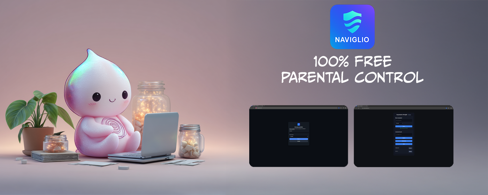
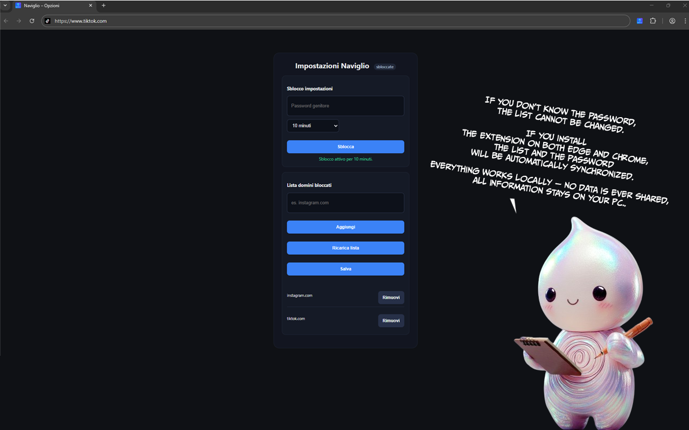

# Naviglio

<p align="center">
  
</p>

**Parental Control for Chrome and Edge**</br>
Developed by **Federico Bicocchi**</br>
Mascotte Design by **Nicole Durì**</br>
Version: **0.5.0**</br>  
License: MIT (free and open source)</br>

---

## 📖 Overview
Naviglio is a lightweight parental control tool that blocks access to unwanted websites.  
When a blocked site is accessed, the extension asks for a password to temporarily unlock it.  

- 🚫 Block any domain you choose  
- 🔑 Unlock temporarily with a parent password  
- ⚡ Native Host integration (Windows) for secure configuration  
- ✅ Completely free to use  

---

<p align="center">
  
</p>

## 📦 Installation

### 1. Install the Host (required)
Download the **latest Windows installer** from the [Releases page](../../releases).  
This will install the background service (`NaviglioHost.exe`) that the extension uses to manage blocked domains and passwords.

### 2. Add the Extension
At the moment the extension is not yet published in the Chrome Web Store.  
You can test it locally in **Developer Mode**:

1. Clone this repository or download it as ZIP:  
   ```bash
   git clone https://github.com/kennethbicocchi/Naviglio-.git

2. Open Chrome and go to chrome://extensions/

3. Enable Developer mode (top right switch)

4. Click Load unpacked

5. Select the extension/ folder from this repo

6. Default Password "Naviglio"

<p align="center">
  
</p>
